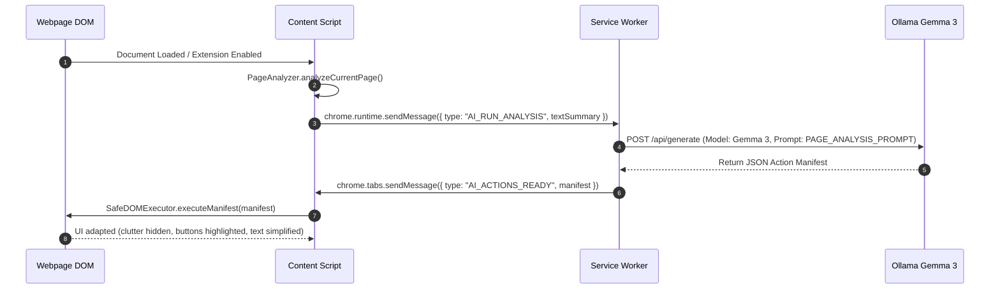
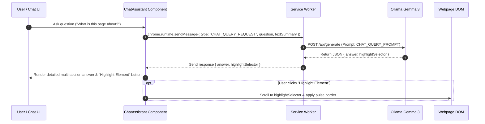
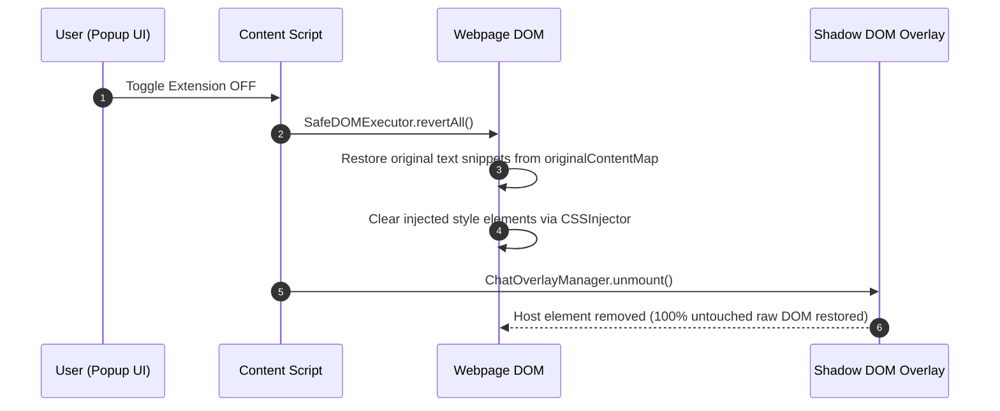

# 🛡️ Sahayak AI — Architecture & System Guide

> **Tagline**: *The AI Layer That Makes Every Website Human-Friendly.*  
> **Mission**: Sahayak sits seamlessly on top of any webpage to intelligently simplify, adapt, and answer questions about the site using **local, privacy-first AI (Google Gemma 3 via Ollama)** without relying on cloud API keys or leaking user data.

---

## 📐 1. System Architecture Overview

Sahayak is built as a production-grade **Chrome Extension (Manifest V3)** powered by a modular TypeScript architecture.

```
┌─────────────────────────────────────────────────────────────────────────────┐
│                            TARGET WEBPAGE (DOM)                             │
└──────┬───────────────────────────────────────────────────────────────▲──────┘
       │                                                               │
       │ (DOM Extraction)                                              │ (DOM Adaptation & Overlays)
       ▼                                                               │
┌──────────────────────────────────────────────────────────────────────┴──────┐
│                            CONTENT SCRIPT RUNTIME                           │
│  ┌───────────────────────┐ ┌──────────────────────┐ ┌─────────────────────┐ │
│  │     PageAnalyzer      │ │   SafeDOMExecutor    │ │ ChatOverlayManager  │ │
│  │ (DOM Tree Extraction) │ │ (Reversible Mutations│ │ (Shadow DOM Isolation)│
│  └───────────┬───────────┘ └───────────▲──────────┘ └───────────▲─────────┘ │
└──────────────│─────────────────────────│────────────────────────│───────────┘
               │                         │                        │
               │ chrome.runtime          │ chrome.runtime         │
               │ .sendMessage()          │ .onMessage             │
               ▼                         │                        │
┌────────────────────────────────────────┴────────────────────────┴───────────┐
│                       BACKGROUND SERVICE WORKER                             │
│                  (IPC Router & Task Orchestrator)                           │
└──────────────────────────────┬──────────────────────────────────────────────┘
                               │ HTTP / JSON API
                               ▼
┌─────────────────────────────────────────────────────────────────────────────┐
│                    LOCAL OLLAMA ENGINE (http://localhost:11434)             │
│                      Model: Gemma 3 (gemma3:4b / local tags)                 │
└─────────────────────────────────────────────────────────────────────────────┘
```

### Key Architectural Principles

1. **🔒 100% Local & Privacy-First**: All AI inference runs locally on the user's desktop machine via Ollama (`http://localhost:11434` or `http://127.0.0.1:11434`). Zero cloud API keys or external telemetry.
2. **🔄 100% Reversible DOM Mutations**: Every DOM modification (element hiding, text simplification, custom CSS injection, accessibility scaling) is tracked in memory (`originalContentMap`, `cssInjector`). Toggling Sahayak OFF cleanly restores 100% untouched raw DOM.
3. **🛡️ Shadow DOM Isolation**: Floating UI overlays (such as the AI Chat Assistant) are rendered inside an isolated `ShadowRoot` (`#sahayak-chat-shadow-host`). This prevents target webpage CSS from breaking the assistant UI, and vice versa.
4. **💻 DevTools Console Operability**: Exposes `window.Sahayak` on every page, allowing developers and users to trigger DOM adaptations, inspect page extracts, and ask AI questions directly from Chrome DevTools Console.

---

## 📂 2. Directory Structure & Module Breakdown

```
Sahayak/
├── src/
│   ├── ai/                      # Local AI Module (Gemma 3 / Ollama)
│   │   ├── api/                 # Ollama Gemma 3 HTTP Client & Model Auto-Discovery
│   │   ├── decision/            # AI Decision Engine (conflict resolution & action filtering)
│   │   ├── parser/              # Robust JSON output parser & Zod schema validation
│   │   ├── prompts/             # System prompts for page analysis & chat queries
│   │   └── schemas/             # Zod action manifest & page summary schemas
│   │
│   ├── dom/                     # DOM Manipulation & UI Adaptation Engine
│   │   ├── accessibility/       # Accessibility Engine (subtle font scaling, high contrast, reduced motion)
│   │   ├── analyzer/            # PageAnalyzer (TreeWalker DOM context extractor)
│   │   ├── engine/              # SafeDOMExecutor (reversibly applies AI manifests)
│   │   ├── injector/            # CSSInjector (manages style tag injection and cleanup)
│   │   └── overlays/            # ChatOverlayManager & Shadow DOM mounting controllers
│   │
│   ├── extension/               # Chrome Extension Entrypoints & IPC
│   │   ├── background/          # Service Worker message router (`service-worker.ts`)
│   │   ├── content/             # Content script entrypoint (`content-script.ts`)
│   │   ├── messaging/           # MessageRouter (active tab IPC helper)
│   │   ├── popup/               # Popup UI (Extension toggle & status view)
│   │   └── storage/             # ChromeStorageService (typed local storage wrapper)
│   │
│   ├── forms/                   # UI Assistant & Settings Views
│   │   ├── assistant/           # ChatAssistant (Floating AI chat panel in React)
│   │   └── settings/            # Extension Settings & Personalization panel
│   │
│   └── shared/                  # Shared Types, Constants & Contracts
│       ├── constants/           # Extension constants & storage keys
│       └── types/               # TypeScript message interfaces & AI action contracts
│
├── tests/                       # Vitest unit test suite
├── manifest.json                # Chrome Extension Manifest V3 configuration
├── vite.config.ts               # Vite build & bundle configuration
└── package.json                 # Project dependencies & npm scripts
```

---

## 🔄 3. Subsystem Breakdown & Data Flow

### A. Content Script (`content-script.ts`)
- **Injection Site**: Injected automatically onto all matching webpages (`<all_urls>`).
- **Responsibilities**:
  - Initializes `PageAnalyzer`, `SafeDOMExecutor`, and `ChatOverlayManager`.
  - Automatically triggers `triggerAutoAnalysis()` when the extension is active.
  - Listens for `chrome.runtime.onMessage` IPC events (`AI_ACTIONS_READY`, `HIGHLIGHT_TARGET_ELEMENT`, `SAHAYAK_TOGGLE_STATE`).
  - Registers the global `window.Sahayak` object for DevTools console commands.

### B. Background Service Worker (`service-worker.ts`)
- **Role**: Acts as the central IPC router for the extension.
- **Responsibilities**:
  - Receives `AI_RUN_ANALYSIS` messages, queries storage for the local Ollama host URL, and calls `OllamaGemmaClient.generatePageAdaptation()`.
  - Dispatches `AI_ACTIONS_READY` back to the content script of the active tab.
  - Receives `CHAT_QUERY_REQUEST` messages and routes queries to `OllamaGemmaClient.askPageQuestion()`.
  - Broadcasts `HIGHLIGHT_TARGET_ELEMENT` messages to scroll and focus target elements.

### C. Local AI Engine (`OllamaGemmaClient` & Prompts)
- **Host Resolution & Model Auto-Discovery**:
  - Automatically tests candidate Ollama hosts (`http://localhost:11434`, `http://127.0.0.1:11434`).
  - Queries `GET /api/tags` to auto-detect installed local models (`gemma3:4b`, `gemma3`, `gemma`, or first available fallback).
- **Prompt Architecture (`gemma3-prompts.ts`)**:
  - `PAGE_ANALYSIS_PROMPT`: Instructs Gemma 3 to analyze page structure and produce JSON action manifests.
  - `CHAT_QUERY_PROMPT`: Directs Gemma 3 to answer user questions using the extracted webpage context with section breakdowns and CSS selector targets.
- **Robust Parsing & Fallback Engine**:
  - Handles markdown-wrapped JSON (` ```json `), raw text responses, and malformed outputs smoothly.
  - Features dynamic fallback routines (`getFallbackMockManifest` and `getFallbackChatAnswer`) that build detailed multi-section summaries using real webpage domain, headings, buttons, and form inputs even if Ollama is starting up or offline.

### D. Safe DOM Engine & Accessibility (`SafeDOMExecutor`)
- **Execution Pipeline**:
  - Consumes a `SahayakActionManifest` and executes actions safely:
    - `HIGHLIGHT_ELEMENT`: Applies high-contrast pulse outlines (`outline: 3px solid #38bdf8`).
    - `HIDE_ELEMENT`: Hides non-essential clutter, ads, floating popups, and sidebars (`.ad, aside, .sidebar, .banner, .footer-links, .social-share, .promo`).
    - `SIMPLIFY_TEXT`: Replaces complex legal jargon with clear, readable badges (`.sahayak-simplified-badge`).
    - `AUTOFILL_FORM`: Prefills form fields safely.
    - `INJECT_CSS`: Injects custom scope-tagged CSS into `<head>`.
    - `ACCESSIBILITY_ENHANCE`: Applies subtle typography line-height (`1.7`) and font scaling.
- **Reversion Mechanism (`revertAll()`)**:
  - Restores all original innerHTML text snippets from `originalContentMap`.
  - Removes all injected `<style>` blocks via `CSSInjector.clearAllInjections()`.
  - Resets Accessibility Engine overrides.

### E. Isolated UI Overlay (`ChatOverlayManager` & `ChatAssistant.tsx`)
- **Shadow DOM Isolation**:
  - Creates `#sahayak-chat-shadow-host` and attaches an open `ShadowRoot`.
  - Injects comprehensive dark theme styles and Tailwind utility CSS rules directly into the shadow root to guarantee zero transparency and prevent page style conflicts.
  - Renders the React `ChatAssistant` component inside the isolated Shadow DOM container.

---

## 📊 4. Sequence Diagrams (Mermaid)

### Sequence 1: Automatic Page Analysis & UI Adaptation Flow



### Sequence 2: Context-Aware AI Chat Query Flow



### Sequence 3: Extension Disable & DOM Revert Lifecycle



---

## 📡 5. Message Protocol & IPC API Reference

All inter-process communication (IPC) uses strongly typed JSON payloads defined in [`src/shared/types/messages.ts`](file:///c:/Users/dhruv/OneDrive/Desktop/SAHAYAK/Sahayak/src/shared/types/messages.ts).

| Message Type | Direction | Payload Interface | Purpose |
| :--- | :--- | :--- | :--- |
| `AI_RUN_ANALYSIS` | Content Script ➔ Service Worker | `{ textSummary: string, userPreferences: object }` | Requests Gemma 3 analysis of the extracted webpage structure. |
| `AI_ACTIONS_READY` | Service Worker ➔ Content Script | `{ manifest: SahayakActionManifest }` | Dispatches generated UI adaptation actions to be executed on the DOM. |
| `CHAT_QUERY_REQUEST` | Chat UI ➔ Service Worker | `{ question: string, pageUrl: string, textSummary: string }` | Sends user chat question along with webpage context to Ollama. |
| `CHAT_QUERY_RESPONSE` | Service Worker ➔ Chat UI | `{ answer: string, highlightSelector?: string }` | Returns AI chat answer and optional element selector to highlight. |
| `HIGHLIGHT_TARGET_ELEMENT` | Service Worker ➔ Content Script | `{ selector: string, label?: string }` | Scrolls to and highlights a specific target CSS selector. |
| `SAHAYAK_TOGGLE_STATE` | Popup ➔ Content Script | `{ active: boolean }` | Toggles extension active state (mounts overlay & auto-analyzes vs reverts & unmounts). |
| `DOM_ANALYZE_PAGE` | Service Worker ➔ Content Script | `{ pageUrl: string, forceFresh?: boolean }` | Triggers a synchronous extraction of webpage metadata. |
| `PING_BACKGROUND` | Extension ➔ Service Worker | `{ timestamp: number }` | Health check ping to verify service worker connectivity. |

---

## 💻 6. DevTools Console API (`window.Sahayak`) Reference

On every injected webpage, Sahayak registers the global `window.Sahayak` object in Chrome DevTools Console for interactive debugging and manual execution:

```javascript
// List all available console commands
window.Sahayak.help()

// Ask AI a question about the current webpage and highlight the target answer element
window.Sahayak.ask("Where do I upload documents?")

// Highlight and scroll to any CSS selector
window.Sahayak.highlight("#btn-submit-application", "#38bdf8")

// Simplify complex text on the page
window.Sahayak.simplifyText(".policy-disclaimer", "Simplified: Review all details before submitting.")

// Hide distracting elements manually
window.Sahayak.hideElement(".ad-banner")

// Inject dynamic custom CSS into the webpage head
window.Sahayak.injectCSS("body { font-size: 18px !important; line-height: 1.8 !important; }")

// Prefill form inputs automatically
window.Sahayak.autofill({ "#applicant-name": "Alex", "#income": "500000" })

// Adjust accessibility settings
window.Sahayak.setHighContrast(true)
window.Sahayak.setFontScale(1.1)

// Revert all DOM changes and restore 100% raw untouched webpage DOM
window.Sahayak.revertAll()

// Print extracted webpage metadata JSON
console.log(window.Sahayak.analyzePage())
```

---

## 🛠️ 7. Build & Testing Commands

- **Typecheck**: `npm run typecheck` (Runs `tsc --noEmit`)
- **Build**: `npm run build` (Compiles TypeScript & Vite bundle into `dist/`)
- **Unit Tests**: `npm run test` (Runs Vitest test suite)
- **Dev Watch**: `npm run dev` (Runs Vite in development mode)
