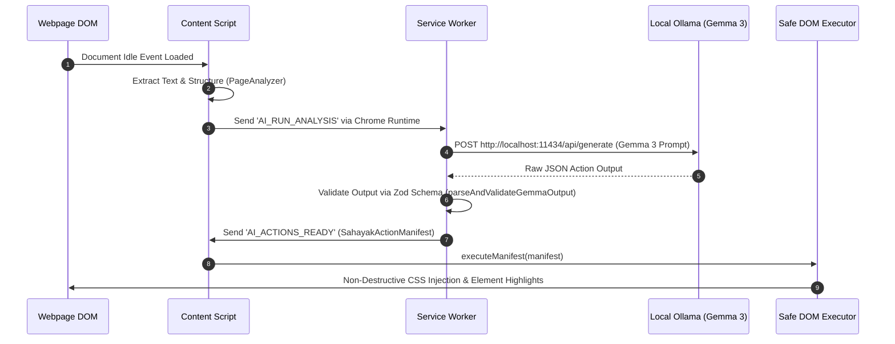

# Sahayak Architectural Blueprint & Technical Specification

## 1. System Architectural Overview

**Sahayak** is a local, privacy-first Chrome Extension (Manifest V3) that dynamically adapts any website to the user's needs.

```text
+-----------------------------------------------------------------------------------+
|                                 TARGET WEBPAGE                                    |
|                                                                                   |
|  +---------------------------+               +---------------------------------+  |
|  | Target Website DOM Nodes  |               |  Sahayak React Shadow DOM UI    |  |
|  +---------------------------+               +---------------------------------+  |
|                ^                                              ^                   |
+----------------|----------------------------------------------|-------------------+
                 | (Safe DOM Execution)                         | (Renders Overlays)
                 v                                              |
+-----------------------------------------------------------------------------------+
|                           SAHAYAK CONTENT SCRIPT                                  |
|                                                                                   |
|   +--------------------------+               +---------------------------------+  |
|   |   DOM Page Analyzer      |               |      Safe DOM Executor          |  |
|   +--------------------------+               +---------------------------------+  |
+----------------|----------------------------------------------^-------------------+
                 |                                              |
                 | (Chrome Runtime IPC)                         | (Delivers Action Manifest)
                 v                                              |
+-----------------------------------------------------------------------------------+
|                        BACKGROUND SERVICE WORKER (SW)                            |
|                                                                                   |
|   +----------------------------------------------------------------------------+  |
|   |                      Typed IPC Message Router                              |  |
|   +----------------------------------------------------------------------------+  |
+----------------|------------------------------------------------------------------+
                 |
                 | HTTP POST (No API Keys / Local Only)
                 v
+-----------------------------------------------------------------------------------+
|                        LOCAL OLLAMA AI SERVER (Gemma 3)                           |
|                                                                                   |
|   Endpoint: http://localhost:11434/api/generate                                   |
|   Model:    gemma3:4b                                                             |
+-----------------------------------------------------------------------------------+
```

---

## 2. Core Architecture Principles

1. **Strict Local Execution (Zero Cloud Dependencies)**:
   - All AI inference targets local Ollama (`http://localhost:11434`).
   - No external network calls, zero cloud API keys, 100% user privacy.
2. **Feature Isolation & Strict Module Boundaries**:
   - `src/ai` (Dev 3), `src/dom` (Dev 2), `src/extension` (Dev 1), `src/forms` (Dev 4) are strictly isolated.
   - **Rule**: Direct cross-module imports between feature directories are forbidden.
   - All inter-module communication is mediated via `@shared/types`, `@shared/stores`, or Chrome Runtime Messages.
3. **Non-Invasive Ephemeral DOM Mutations**:
   - The AI **NEVER** mutates or touches the DOM directly. It returns Zod-validated `SahayakActionManifest` JSON.
   - The DOM Engine (`src/dom/engine/action-executor.ts`) interprets JSON actions, applies temporary highlights/CSS injections, and restores original DOM state upon tab reload or reset.
4. **State Management & Shared Infrastructure**:
   - Global application and preference state managed using **Zustand** stores (`src/shared/stores/`).

---

## 3. Module Boundaries & Ownership Model

| Directory | Owner | Scope & Responsibilities |
| :--- | :--- | :--- |
| `src/extension/` | **Developer 1** | Chrome Manifest V3 setup, Service Worker event loop, Content Script loading, Popup React app, Message Router, Chrome Storage API services. |
| `src/dom/` | **Developer 2** | Page Analyzer, Safe Action Executor, Scoped Dynamic CSS Injector, Accessibility Engine, Shadow DOM Overlays. |
| `src/ai/` | **Developer 3** | Local Ollama Client (`http://localhost:11434`), Gemma 3 prompt templates, Zod JSON schema validation, Decision Engine. |
| `src/forms/` | **Developer 4** | Form Field Detector, Smart Autofill Engine, Personalization Store, User Preferences, Settings React UI. |
| `src/shared/` | **All Team** | Shared Types (`messages.ts`, `ai-actions.ts`), Zustand stores, Design system primitives, Utilities, Constants. |

---

## 4. End-to-End Execution Flow



---

## 5. Verification & Continuous Integration

All changes pushed to `main` or `develop` must pass the GitHub Actions CI pipeline (`.github/workflows/ci.yml`):
- `npm run typecheck` — TypeScript strict type checking
- `npm run lint` — ESLint flat configuration check
- `npm run format:check` — Prettier style validation
- `npm run build` — Production Vite extension compilation
