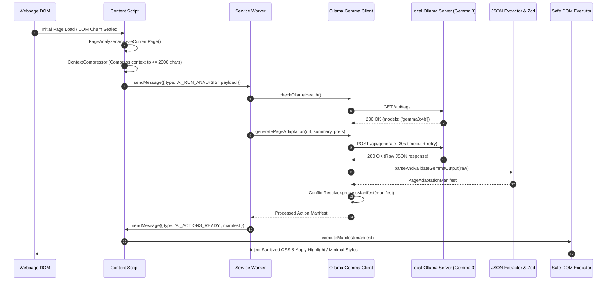

# Sahayak AI Data Flow Sequence 🤖

This document describes the sequence of execution for page adaptation and chat queries via local Gemma 3.

```mermaid
sequenceDiagram
    autonumber
    participant Page as Webpage DOM
    participant CS as Content Script
    participant SW as Service Worker
    participant Client as Ollama Gemma Client
    participant Ollama as Local Ollama Server (Gemma 3)
    participant Parser as JSON Extractor & Zod
    participant Executor as Safe DOM Executor

    Page->>CS: Initial Page Load / DOM Churn Settled
    CS->>CS: PageAnalyzer.analyzeCurrentPage()
    CS->>CS: ContextCompressor (Compress context to <= 2000 chars)
    CS->>SW: sendMessage({ type: 'AI_RUN_ANALYSIS', payload })
    SW->>Client: checkOllamaHealth()
    Client->>Ollama: GET /api/tags
    Ollama-->>Client: 200 OK (models: ['gemma3:4b'])
    SW->>Client: generatePageAdaptation(url, summary, prefs)
    Client->>Ollama: POST /api/generate (30s timeout + retry)
    Ollama-->>Client: 200 OK (Raw JSON response)
    Client->>Parser: parseAndValidateGemmaOutput(raw)
    Parser-->>Client: PageAdaptationManifest
    Client->>Client: ConflictResolver.processManifest(manifest)
    Client-->>SW: Processed Action Manifest
    SW->>CS: sendMessage({ type: 'AI_ACTIONS_READY', manifest })
    CS->>Executor: executeManifest(manifest)
    Executor->>Page: Inject Sanitized CSS & Apply Highlight / Minimal Styles
```
