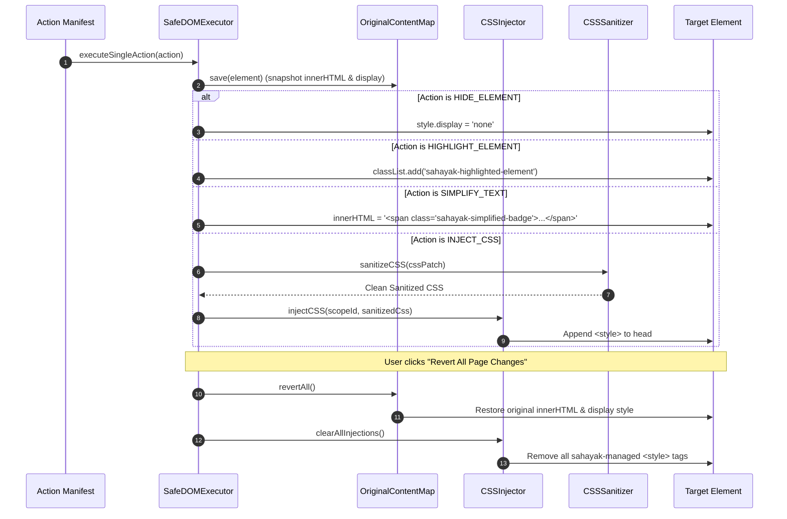

# Sahayak DOM Mutation & Reversion Flow 🎨

This document details how Sahayak safely mutates the target webpage DOM and restores 100% untouched state.

```mermaid
sequenceDiagram
    autonumber
    participant Action as Action Manifest
    participant Executor as SafeDOMExecutor
    participant Map as OriginalContentMap
    participant Injector as CSSInjector
    participant Sanitizer as CSSSanitizer
    participant Target as Target Element

    Action->>Executor: executeSingleAction(action)
    Executor->>Map: save(element) (snapshot innerHTML & display)
    alt Action is HIDE_ELEMENT
        Executor->>Target: style.display = 'none'
    else Action is HIGHLIGHT_ELEMENT
        Executor->>Target: classList.add('sahayak-highlighted-element')
    else Action is SIMPLIFY_TEXT
        Executor->>Target: innerHTML = '<span class="sahayak-simplified-badge">...</span>'
    else Action is INJECT_CSS
        Executor->>Sanitizer: sanitizeCSS(cssPatch)
        Sanitizer-->>Executor: Clean Sanitized CSS
        Executor->>Injector: injectCSS(scopeId, sanitizedCss)
        Injector->>Target: Append <style> to head
    end

    Note over Executor,Target: User clicks "Revert All Page Changes"
    Executor->>Map: revertAll()
    Map->>Target: Restore original innerHTML & display style
    Executor->>Injector: clearAllInjections()
    Injector->>Target: Remove all sahayak-managed <style> tags
```
